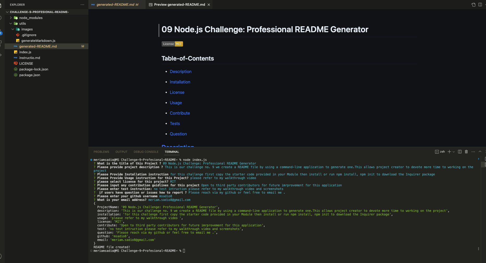
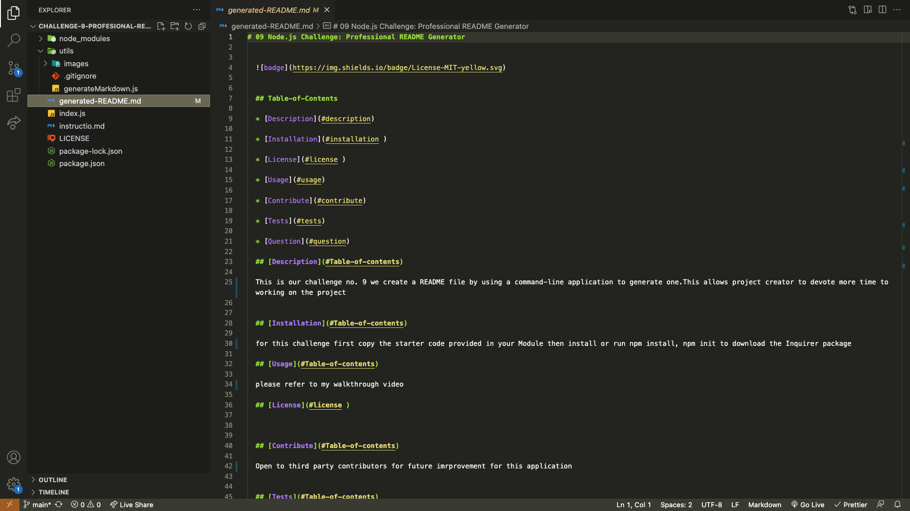

# Node.js Challenge: Professional README Generator

## Description

This is an open source project on GitHub a high-quality README for the app. This include what the app is for, how to use the app, how to install it, how to report issues, and how to make contributions&mdash;this last part increases the likelihood that other developers will contribute to the success of the project.

## Table-of-Contents

- [Description](#description)

- [Installation](#installation)

- [License](#license)

- [Usage](#usage)

- [Contribute](#contribute)

- [Tests](#tests)

- [Question](#question)

## Installation

clone starter code , open VS code run npm init ,npm i inquirer@8.2.4.

## Usage

No usage instruction please refer to my walkthrough video

## license

[MIT](https://opensource.org/licenses/)

## Tests

No test intruction please refer to my walkthrough video

[Walkthrough video click here 🎬](https://drive.google.com/file/d/1wDMi6mh31hqJTdMA7jMz3qLcIX9vxuYS/view)

## Question

Please contact through github or feel free to email me

## Github

[Github](https://github.com/msadio8/Challenge-9-Profesional-README-)

## Email

meriam.sadio8@gmail.com
