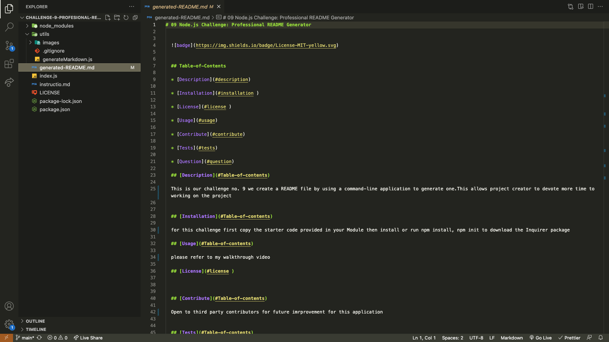

# Node.js Challenge: Professional README Generator

## Table-of-Contents

- [Description](#description)

- [Installation](#installation)

- [License](#license)

- [Usage](#usage)

- [Contribute](#contribute)

- [Tests](#tests)

- [Question](#question)

## [Description](#Table-of-contents)

This is an open source project on GitHub a high-quality README for the app. This include what the app is for, how to use the app, how to install it, how to report issues, and how to make contributions&mdash;this last part increases the likelihood that other developers will contribute to the success of the project.

## [Installation](#Table-of-contents)

First clone the starter code provided in the Module 9 , then run npm init and npm i inquirer@8.2.4. in the VS code terminal

## [Usage](#Table-of-contents)

No usage instruction please refer to my walkthrough video

## [License](#license)

[MIT license](https://opensource.org/license/mit/)

## [Contribute](#Table-of-contents)

Open to third party contributors for future development of this application.

## [Tests](#Table-of-contents)

No test instruction please refer to my walkthrough video and screenshots

[Walkthrough video click here 🎬](https://drive.google.com/file/d/1wDMi6mh31hqJTdMA7jMz3qLcIX9vxuYS/view)

## [Question](#Table-ofcontents)

Please contact me through github or feel free to email me

[Github](https://github.com/msadio8)

[Email: meriam.sadio8@gmail.com](mailto:meriam.sadio8@gmail.com)
